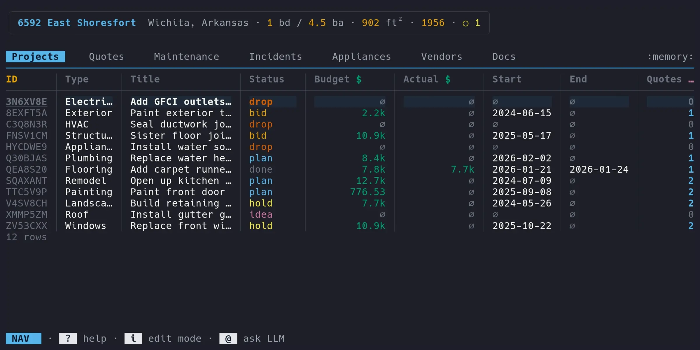

<!-- Copyright 2026 Phillip Cloud -->
<!-- Licensed under the Apache License, Version 2.0 -->

<div align="center">
  

  <br><br>

  [](https://github.com/micasa-dev/micasa/actions/workflows/ci.yml)
  [](https://github.com/micasa-dev/micasa/releases/latest)
  [](https://go.dev)
  [](https://micasa.dev/docs)
</div>

# `micasa`

Home maintenance, from the terminal.

<div align="center">
  
</div>

## Features

- **When did I last change the furnace filter?** Schedules, due dates, full history. Set it and forget it.
- **What if we finally did the backyard?** Projects from napkin sketch to completion, or graceful abandonment.
- **How much would it cost to…** Quotes side by side, vendor history, and the math to actually decide.
- **Who did we use last time?** Every contractor, every quote, every job. All searchable.
- **How much have I spent on plumbing this year?** Ask a local LLM. Or don't. Offline until you say otherwise.

## Keyboard driven

Vim-style modal keys: `nav` mode to browse, `edit` mode to change things. Sort by any column, jump to columns with fuzzy search, hide what you don't need, and drill into related records.

See the full [keybinding reference](https://micasa.dev/docs/reference/keybindings/).

## Install

```sh
go install github.com/micasa-dev/micasa/cmd/micasa@latest
```

Or grab a [binary](https://github.com/micasa-dev/micasa/releases/latest) for Linux, macOS, or Windows.

Then:

```sh
micasa demo         # sample data
micasa              # your house
```

## Documentation

Full docs at [micasa.dev/docs](https://micasa.dev/docs/).

## Development

[Pure Go](https://go.dev), zero CGO. Built on [Charmbracelet](https://github.com/charmbracelet) + [GORM](https://gorm.io) + [SQLite](https://sqlite.org). TUI design inspired by [VisiData](https://www.visidata.org/). Developed with AI coding agents ([Claude](https://claude.ai), [Claude Code](https://claude.ai/code)).

PRs welcome, including AI-assisted ones, as long as you've reviewed and curated the code. See the [contributing guide](https://micasa.dev/docs/development/contributing/).

```sh
nix develop                      # enter dev shell
go test -shuffle=on ./...        # run tests
```

## License

Apache-2.0. See [LICENSE](LICENSE).
