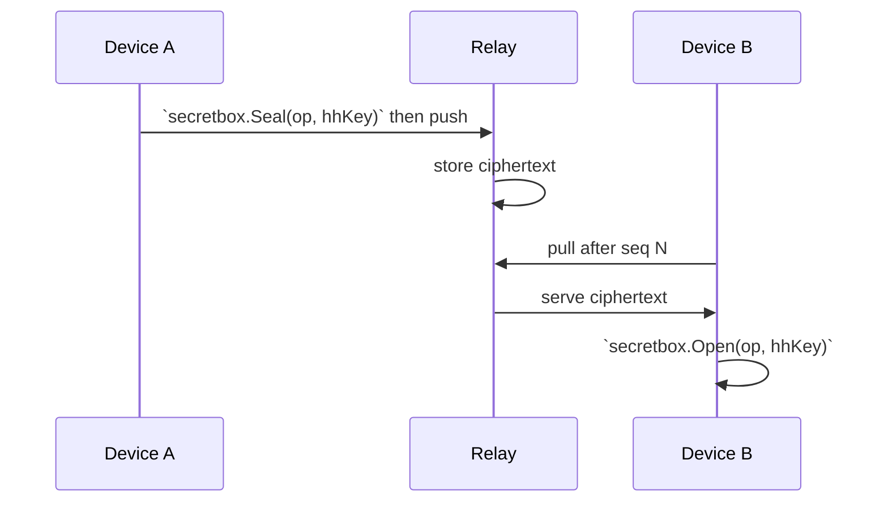
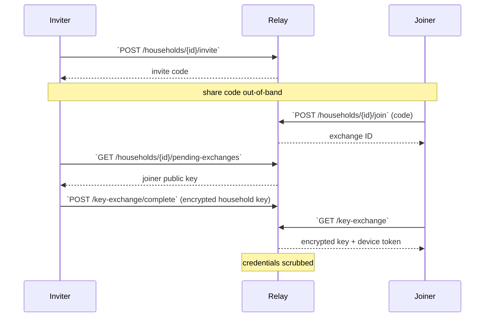
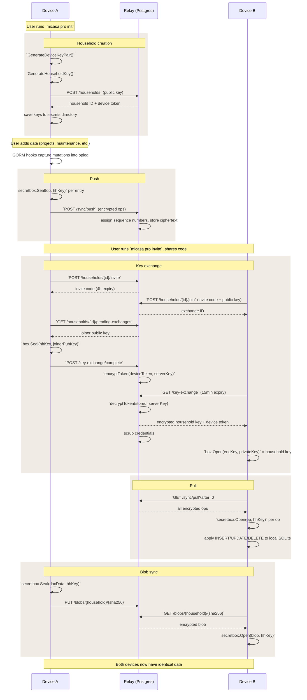

+++
title = "Encrypted Relay"
weight = 3
description = "How the sync relay works: store interface, auth, encryption, key exchange."
linkTitle = "Encrypted Relay"
+++

The relay is a standalone HTTP server that mediates encrypted sync
between micasa devices. It stores encrypted data without the ability
to read it.

## Store interface

All relay persistence goes through the `Store` interface. Two
implementations exist:

- **MemStore** — in-memory, mutex-protected. Used in tests.
- **PgStore** — PostgreSQL via GORM. Used in production.

Both implement the same 21 methods covering: push/pull, household
management, device auth, invites, key exchange, subscriptions,
blob storage, and token encryption key setup.

The interface is defined in `internal/relay/store.go`.

## Authentication

Devices authenticate with bearer tokens. The flow:

1. Device sends `Authorization: Bearer <token>` on every request
2. `requireAuth` middleware hashes the token (SHA-256)
3. Looks up the hash in `pg_devices.token_sha` (indexed)
4. Returns the `Device` struct to the handler

Tokens are generated as 256-bit random hex strings. Only the
SHA-256 hash is stored server-side — the raw token lives on the
device in the local secrets directory.

## Encryption layers

### Household data ([NaCl secretbox](https://nacl.cr.yp.to/secretbox.html))

All sync data is end-to-end encrypted with a per-household key
using [NaCl secretbox](https://nacl.cr.yp.to/secretbox.html) ([XSalsa20-Poly1305](https://en.wikipedia.org/wiki/Salsa20#XSalsa20_with_Poly1305)). The relay never sees
plaintext — it stores and serves ciphertext.



### Device tokens at rest ([AES-256-GCM](https://en.wikipedia.org/wiki/Galois/Counter_Mode))

During the key exchange (join flow), a device token is temporarily
stored on the relay so the joining device can retrieve it. This
token is encrypted at rest with a server-side [AES-256-GCM](https://en.wikipedia.org/wiki/Galois/Counter_Mode) key
(`RELAY_ENCRYPTION_KEY`) and scrubbed after first retrieval.

### Webhook signatures (HMAC-SHA256)

Stripe webhook payloads are verified using HMAC-SHA256 with a
tolerance window of 5 minutes.

## Key exchange (join flow)

Adding a device to a household:



Invite codes expire after 4 hours. Key exchanges expire after
15 minutes. Credentials are single-use — scrubbed after first
retrieval.

## Sync engine

The sync engine (`internal/sync/engine.go`) runs on each device:

1. **Push** — read unsynced oplog entries, encrypt each with the
   household key, POST to `/sync/push`
2. **Pull** — GET `/sync/pull?after=<last_seq>`, decrypt, apply
   each operation to the local SQLite database
3. **Blobs** — upload document blobs as encrypted content-addressed
   objects (SHA-256 key, 50 MB max, dedup via 409 Conflict)

Conflict resolution uses last-writer-wins (LWW) by `created_at`
timestamp. The oplog is append-only — no operation is ever deleted.

## Sequence numbering

Each household has a `seq_counter` on its row. When a device pushes
ops, the relay increments the counter atomically (within a
transaction) and assigns the new value as the op's sequence number.
Devices pull by saying "give me everything after seq N."

This guarantees total ordering within a household without
cross-household coordination.

## Blob storage

Documents are synced as encrypted blobs, separate from the oplog:

- Content-addressed by SHA-256 hash
- 50 MB max per blob
- Deduplication via 409 Conflict (same hash = same content)
- Per-household quota (configurable, default unlimited for
  self-hosted)
- Oplog entries reference blobs via `blob_ref` field, which is
  stripped before applying to the local database

## Database schema (PostgreSQL)

```
households     — id, seq_counter, stripe fields, created_at
devices        — id, household_id, name, public_key, token_sha
ops            — seq, household_id, id, device_id, nonce, ciphertext
invites        — code, household_id, created_by, expires_at, consumed
key_exchanges  — id, household_id, joiner info, encrypted credentials
blobs          — household_id, hash, data, size_bytes
```

All table names use bare English (not `pg_` prefixed). The Go
struct names use a `pg` prefix (`pgHousehold`, `pgDevice`) to
distinguish them from the `sync.Household` and `sync.Device`
shared types.

## End-to-end data flow

From first setup through ongoing sync:



## Package layout

```
cmd/relay/           Relay entry point, env var parsing
internal/
  relay/             HTTP handler, store interface, implementations
    handler.go       Route setup, middleware, request handlers
    store.go         Store interface (21 methods)
    memstore.go      In-memory implementation (testing)
    pgstore.go       PostgreSQL implementation (production)
    stripe.go        Webhook signature verification
    tokencrypt.go    AES-256-GCM token encryption at rest
    blob.go          Blob storage constants and validation
  sync/              Shared types and client
    types.go         Household, Device, Envelope, request/response types
    client.go        HTTP client for push/pull
    household.go     HTTP client for management (invite, join, status)
    engine.go        Sync engine (push, pull, apply, conflict resolution)
    apply.go         Oplog entry application (INSERT/UPDATE/DELETE)
  crypto/            Key generation, storage, encryption
    keys.go          Household key, device keypair, token storage
    encrypt.go       NaCl secretbox (XSalsa20-Poly1305)
```
